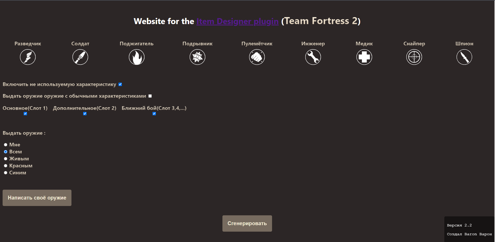
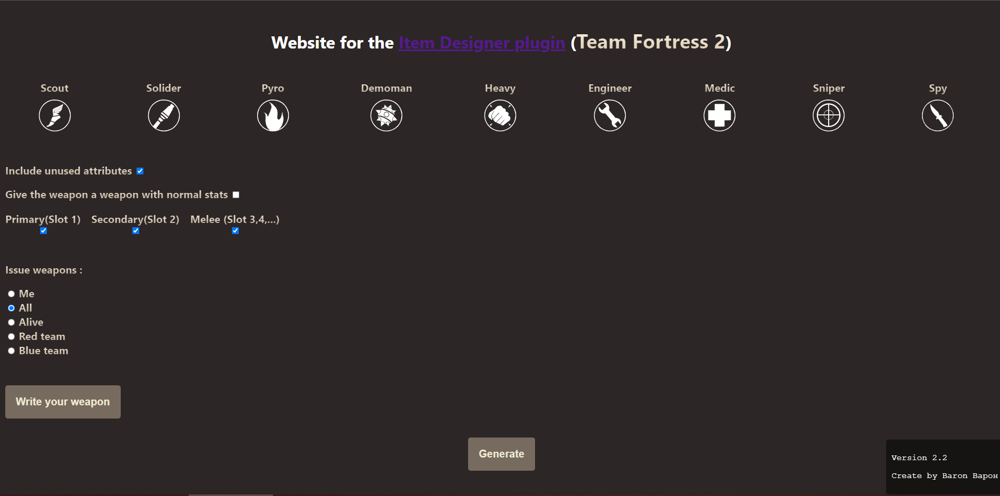

# Website for the <a href="https://forums.alliedmods.net/showthread.php?p=1353985">"Item Designer" plugin</a> Team Fortress 2
<a href="https://artem2222222sda.github.io/Website-for-the-Item-Designer-plugin-Team-Fortress-2__Weapon-Generator/">https://artem2222222sda.github.io/Website-for-the-Item-Designer-plugin-Team-Fortress-2__Weapon-Generator/</a>
 

<h2>What is it?   /   Что это?</h2>
<i>(ENG)---- This site is an addition to the <a href="https://forums.alliedmods.net/showthread.php?p=1353985">Item Designer plugin.</a> Plugin for the game <a href="https://forums.alliedmods.net/showthread.php?p=1353985">Team Fortress 2</a></i>
 
<i>(RUS)---- Это сайт являеться дополнением к плангину <a href="https://forums.alliedmods.net/showthread.php?p=1353985">Item Designer</a>. Плагин предназначен для игры <a href="https://forums.alliedmods.net/showthread.php?p=1353985">Team Fortress 2</a></i>

 
<h2>What can he do?   /   Что он может?</h2>
<i>(ENG)---- The site may:</i>  
<ul>
<b>
  <li> Generate weapons with random stats</li>
  <li> Write a weapon with the characteristics that the user specifies</li>
  </b>
</ul>
<i>I don't think anything more is needed.</i>

  
<i>(RUS)---- Сайт может:</i> 
<ul>
<b>
  <li> Создавайте оружие со случайными характеристиками</li>
  <li> Написать оружие с характеристиками, которые указывает пользователь</li>
  </b>
</ul>
<i>Я не думаю, что что-то еще нужно.</i>

<h2>How to use it?   /   Как им пользоваться?</h2>
<i>(ENG)---- See what you need. If you want to generate weapons with radome stats then :
    
  <b>
  <ul>
    <li>Select the class you need by clicking on the class icon. </li>
    <li>Choose what weapon you want (Primary, Secondary, Melee)</li>
    <li>Choose whom to issue</li>
    <li>Click on the "Generate" button ( The characteristics of the weapon may not match the characteristics in the game.)</li>
  </ul>
  </b>
  
Well, if you want to make your own weapon then : 
    
  <b>
  <ul>
    <li> Click on the button "Write your weapon"</li>
    <li> Select a class (Only one)</li>
    <li> In the window that appears, select the desired weapon.</li>
    <li>Now just below select which feature you want to add.</li>
    <li> A little to the right we write "Power" (1 = 100%; 2 = 200%)</li>
    <li>Press the "Add" button</li>
    <li> Add how many attributes you need( The characteristics of the weapon may not match the characteristics in the game.)</li>
    <li> Press the "Generate command" button</li>
    </ul>
  </b>
</i>

    
<i>(RUS)---- Смотря что вам нужно. Если вы хотите сгенерировать оружие с радомными характеристиками то : 
    
  <b>
   <ul>
     <li> выберите класс который вам нужн нажав по иконке класс. (Вверху)</li>
     <li> Выберите какое вы хотите оружие(Основное, Дополнительон,Рукопашное)</li>
     <li> Выберите кому выдать </li>
     <li> Нажмите на кнопку "Cгенерировать"(Характеристи оружие могут не совпадать с характеристиками в игре).</li>
   </ul>
    </b>
    
   Ну а если вы хотите сделать своё оружие то:
    
  <b>
  <ul>
    <li> Нажмите на кнопку "Написать своё оружие" </li>
    <li> Выберите класс (Только один)</li>
    <li>В появимшемся окне выберите нужное оружие. </li>
    <li>Теперь чуть ниже выбирает какую характеритику вы хотите добавить.</li>
    <li>Чуть правее пишем "Мощность" (1 = 100%; 2 = 200%)</li>
    <li>Нажимаем кнопку "Добавить"</li>
    <li> Добавляем сколко вам надо атрибутов (Характеристи оружие могут не совпадать с характеристиками в игре)</li>
    <li> Нажимаем кнопку "Сгенерировать команду" </li>
 </ul>
  </b>
</i>

<h2 style="color:red">WARNING! / ВНИМАНИЕ! </h2>
<i>(ENG)---- We do not exclude errors, bugs and shortcomings. This project did the number for the sake of interest.
I have translated all the text into English using Google Translate.
Below are links that helped in the creation of this project

  <b>
  <ul>
    <li>TF2 Attribute ---- https://wiki.teamfortress.com/wiki/List_of_item_attributes/ru</li>
      <li>TF2 Weapon and Decorated ---- https://wiki.teamfortress.com/wiki/Weapons and https://wiki.teamfortress.com/wiki/Decorated#The_Concealed_Killer_Collection</li>
    <li>TF2 Item Definition Indexes ---- https://wiki.alliedmods.net/Team_fortress_2_item_definition_indexes</li>
    <li>Plugin ---- https://forums.alliedmods.net/showthread.php?p=1353985</li>
    </ul>
  </b>
  
  I will also say that if you change the code, then I am not responsible for problems on the site.
  
  Please do not remove the inscription in the lower right corner. If you use the project in your projects, then please mention the author
  
  The characteristics of the weapon may not match the characteristics in the game. To prevent the game from crashing, read the approximate characteristics of the weapon. If the game crashes because of some attribute, then add it to the Black List (BlackListAttribute variable)
  
  css and js are in one file
</i>

    
<i>(RUS)---- Я не исключаем ошибок, багов и недочетов. Этот проект сделан ради интереса.
Я перевел весь текст на английский с помощью Google Translate.
Ниже приведены ссылки которые помогали в создании данного проекта

  
  <b>
  <ul>
    <li>TF2 Attribute ---- https://wiki.teamfortress.com/wiki/List_of_item_attributes/ru</li>
    <li>TF2 Weapon and Decorated ---- https://wiki.teamfortress.com/wiki/Weapons and https://wiki.teamfortress.com/wiki/Decorated#The_Concealed_Killer_Collection</li>
    <li>TF2 Item Definition Indexes ---- https://wiki.alliedmods.net/Team_fortress_2_item_definition_indexes</li>
    <li>Плагин ---- https://forums.alliedmods.net/showthread.php?p=1353985</li>
    </ul>
  </b>
  
  Также скажу, что если вы измените код, то я не несу ответственности за проблемы на сайте.
  
   Пожалуйста, не удаляйте надпись в правом нижнем углу. Если вы используете проект в своих проектах, то просьба указывать автора
  
  Характеристи оружие могут не совпадать с характеристиками в игре. Чтобы игра не вылетал читайте приблизительные характристики оружия. Если игра вылетает из-за кого-небудь атрибута то добавте его в Чёрный список(переменная BlackListAttribute)
  
  css и js написаны в одно файле 
  
  :) 
  Baron Варон
</i>
